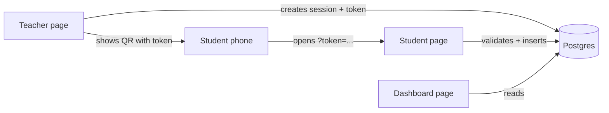

# Attendance Tracker

A teacher opens a session and shows a QR code. Students scan it, enter their roll number, and are marked present. SQL turns the data into attendance reports.

Streamlit + PostgreSQL. One app, three pages, one database.

## Architecture



| File | Role |
|---|---|
| `app.py` | Student page (QR target) |
| `pages/1_Teacher.py` | Password-protected: create session, show QR, live count |
| `pages/2_Dashboard.py` | Attendance % per student/session, students below 75%, trends |
| `db.py` | **All SQL** and the validation chain |
| `schema.sql` / `seed.sql` | Tables with constraints / fake data |
| `tests/` | Constraint tests (SQL) and validation-chain tests (pytest) |

## Schema

- `student(id, name, roll_no UNIQUE, email UNIQUE)`
- `sessions(id, session_name, start_time, end_time, token UNIQUE, CHECK end_time > start_time)`
- `attendance(id, student_id, session_id, submitted_at, UNIQUE(student_id, session_id))`

## Validation chain

Checked in order on every submission; stops at the first failure:

1. Token missing from URL → error
2. Token matches no session → invalid QR
3. DB `now()` outside `start_time`..`end_time` → not started / closed
4. Roll number not in `student` → unknown roll number
5. `INSERT ... ON CONFLICT DO NOTHING`; zero rows inserted → already marked

Notes: queries are parameterized only; there is no check-then-insert race (the unique constraint decides); time comes from the database clock, never the browser.

## Analytical SQL

`db.py` uses window functions for per-student ranking (`rank() OVER`) and running attendance % per student (`sum() OVER (ORDER BY start_time) / row_number() OVER (...)`). Only **ended** sessions count toward percentages, so an open session doesn't penalize anyone.

## Run locally

```bash
python3 -m venv .venv && .venv/bin/pip install -r requirements.txt
createdb attendance_dev
export DATABASE_URL=postgresql:///attendance_dev
psql $DATABASE_URL -f schema.sql -f seed.sql
psql $DATABASE_URL -f tests/test_constraints.sql   # 4 constraint tests
.venv/bin/pytest                                   # validation-chain tests (re-run schema+seed first)
cp .streamlit/secrets.toml.example .streamlit/secrets.toml   # then edit
.venv/bin/streamlit run app.py
```

Seed data includes an open session with token `seedopen`: visit `http://localhost:8501/?token=seedopen` and use roll numbers `CS001`..`CS012`.

## Deploy

Hosted Postgres (Neon or Supabase free tier) + Streamlit Community Cloud. Put `database_url`, `teacher_password`, `app_url`, and `timezone` in the app's Secrets settings. Run `schema.sql` against the hosted DB (skip `seed.sql` in production). Test by scanning from a phone on mobile data.

## Threat model and limitations

- **Photo sharing:** a student can photograph the QR and send it to an absent friend, who can submit from anywhere while the session is open. v1 has no defence. The planned v2 (rotating tokens every 30-60 s via a `session_tokens` table) narrows this window but does not close it: a determined group can still relay a fresh QR within seconds.
- **Roll numbers are not secrets:** anyone who knows a classmate's roll number can mark them present from their own phone. There is no per-student authentication.
- **Attendance % assumes every student attends every session.** Real classes have different groups. The next upgrade is `courses` and `enrollments` tables, with `sessions` linked to a course.
- **Teacher auth is a single shared password**, compared in constant time. Fine for a demo, not for production.
- **Not protected against:** DoS or brute-forcing of roll numbers (no rate limiting).

Protected against: SQL injection (parameterized queries), duplicate marks (DB constraint, race-free), late/early marks (server clock), guessable tokens (`secrets.token_urlsafe`).

## Roadmap

Phase 5 deploy · Phase 6 rotating QR (v2) · courses/enrollments.
